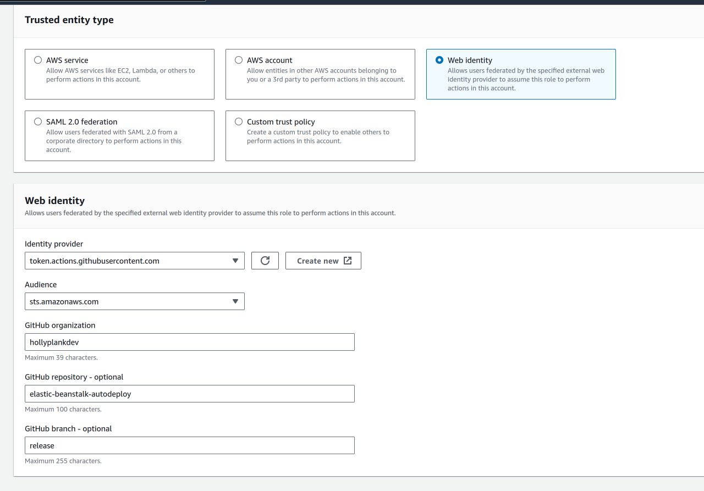

# elastic-beanstalk-autodeploy

A fairly straightforward example showing a docker-compose application's auto-deploy setup using GitHub Actions and AWS' Elastic Beanstalk. This is a pretty small example that I put together for my portfolio projects [motd-api-ts](https://github.com/hollyplankdev/motd-api-ts).

# Resources Used

- [Muharrem K: AWS Elastic Beanstalk with docker-compose.yml file](https://medium.com/adessoturkey/aws-elastic-beanstalk-with-docker-compose-yml-file-ae5958569b2f)
- [GitHub: Configuring OpenID Connect in Amazon Web Services](https://docs.github.com/en/actions/deployment/security-hardening-your-deployments/configuring-openid-connect-in-amazon-web-services#adding-the-identity-provider-to-aws)
- [AWS: Creating and managing an OIDC provider (console)](https://docs.aws.amazon.com/IAM/latest/UserGuide/id_roles_providers_create_oidc.html#manage-oidc-provider-console)
- [AWS: Creating a role for OIDC](https://docs.aws.amazon.com/IAM/latest/UserGuide/id_roles_create_for-idp_oidc.html#idp_oidc_Create)
- [GitHub Actions: configure-aws-credentials](https://github.com/aws-actions/configure-aws-credentials?tab=readme-ov-file#oidc)
- [GitHub Actions: beanstalk-deploy](https://github.com/einaregilsson/beanstalk-deploy)

# Using in a Project

## Step 1 - Configure Repo for Docker

Make sure that you're repository is configured to work as an EB application (in the case of docker, ensure that there is a Dockerfile or docker-compose.yml in the root).

I prefer docker-compose - so when I get here, I just ensure that running `docker-compose up --build` from the root of the repo works as expected. 


## Step 2 - Initialize Elastic Beanstalk Application

Make sure that you have the Elastic Beanstalk CLI [installed](https://docs.aws.amazon.com/elasticbeanstalk/latest/dg/eb-cli3-install.html) and [configured](https://docs.aws.amazon.com/elasticbeanstalk/latest/dg/eb-cli3-configuration.html).


### Initialize EB Application

Initialize the Elastic Beanstalk application by running

```
eb init
```

### Choose a Region
I typically stick to one region when prototyping, and choose the one closest to me.
```
Select a default region
1) us-east-1 : US East (N. Virginia)
2) us-west-1 : US West (N. California)
3) us-west-2 : US West (Oregon)
...
(default is 3): 1
```

### Create an EB Application in AWS
If you don't already have an application created, then `Create new Application`. This will be visible from the AWS console.
```
Select an application to use
1) elastic-beanstalk-autodeploy
2) ebs-docker-test-2
3) getting-started-test
4) [ Create new Application ]
(default is 4): 4
```

If creating a new application, choose an appropriate name.
```
Enter Application Name
(default is "motd-api-ts"): motd-api-ts-example
```

### Set Runtime Platform
When applicable, EB CLI will try to guess what kind of project you're creating. This can be a little dicey when you're deploying a NodeJS app inside of docker. If you get a message like below, make sure to say no so that you can specify that you are creating a docker application. 
```
It appears you are using Node.js. Is this correct?
(Y/n): n
```
```
Select a platform.
1) .NET Core on Linux
2) .NET on Windows Server
3) Docker
4) Go
5) Java
6) Node.js
7) PHP
8) Packer
9) Python
10) Ruby
11) Tomcat
(make a selection): 3

Select a platform branch.
1) Docker running on 64bit Amazon Linux 2023
2) ECS running on 64bit Amazon Linux 2023
3) Docker running on 64bit Amazon Linux 2
4) ECS running on 64bit Amazon Linux 2
(default is 1): 1
```

### CodeCommit?
I typically don't use this.
```
Do you wish to continue with CodeCommit? (Y/n): n
```

### SSH?
I typically don't use this, either.
```
Do you want to set up SSH for your instances?
(Y/n): n
```

# Dev Log

Configure [OIDC between AWS & GitHub](https://docs.github.com/en/actions/deployment/security-hardening-your-deployments/configuring-openid-connect-in-amazon-web-services)

- Followed this https://docs.aws.amazon.com/IAM/latest/UserGuide/id_roles_providers_create_oidc.html
- Followed this https://docs.aws.amazon.com/IAM/latest/UserGuide/id_roles_create_for-idp_oidc.html#idp_oidc_Create
- 
- Gave it permissions `AWSElasticBeanstalkWebTier` and `AWSElasticBeanstalkManagedUpdatesCustomerRolePolicy`
-
